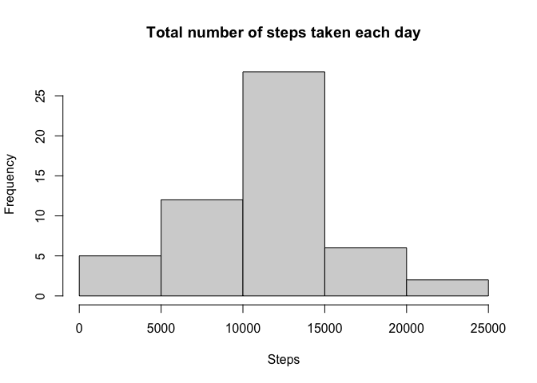
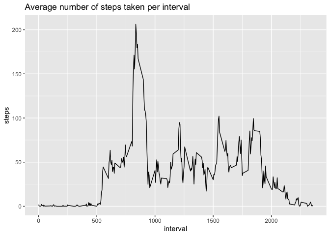
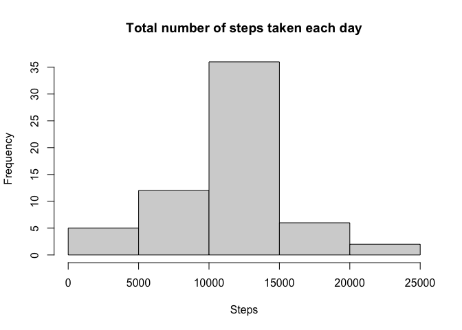
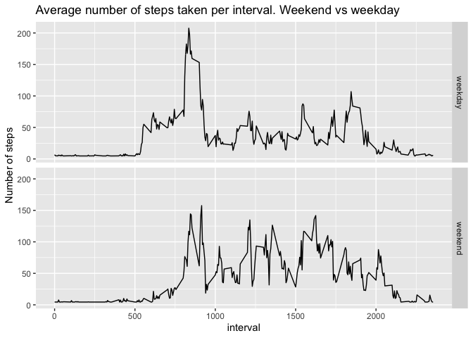

## Loading and preprocessing the data

Show any code that is needed to

1. Load the data (i.e. read.csv()):


```r
library("ggplot2")
data <- read.csv("activity.csv", header = TRUE, sep  = ",", na.strings = "NA")
```

2. Process/transform the data (if necessary) into a format suitable for your
analysis


## What is mean total number of steps taken per day?

For this part of the assignment, you can ignore the missing values in the
dataset.

1. Calculate the total number of steps taken per day


```r
totalsteps <- aggregate(steps ~ date, data = data, sum, na.action = "na.pass")
totalsteps
```

```
##          date steps
## 1  2012-10-01    NA
## 2  2012-10-02   126
## 3  2012-10-03 11352
## 4  2012-10-04 12116
## 5  2012-10-05 13294
## 6  2012-10-06 15420
## 7  2012-10-07 11015
## 8  2012-10-08    NA
## 9  2012-10-09 12811
## 10 2012-10-10  9900
## 11 2012-10-11 10304
## 12 2012-10-12 17382
## 13 2012-10-13 12426
## 14 2012-10-14 15098
## 15 2012-10-15 10139
## 16 2012-10-16 15084
## 17 2012-10-17 13452
## 18 2012-10-18 10056
## 19 2012-10-19 11829
## 20 2012-10-20 10395
## 21 2012-10-21  8821
## 22 2012-10-22 13460
## 23 2012-10-23  8918
## 24 2012-10-24  8355
## 25 2012-10-25  2492
## 26 2012-10-26  6778
## 27 2012-10-27 10119
## 28 2012-10-28 11458
## 29 2012-10-29  5018
## 30 2012-10-30  9819
## 31 2012-10-31 15414
## 32 2012-11-01    NA
## 33 2012-11-02 10600
## 34 2012-11-03 10571
## 35 2012-11-04    NA
## 36 2012-11-05 10439
## 37 2012-11-06  8334
## 38 2012-11-07 12883
## 39 2012-11-08  3219
## 40 2012-11-09    NA
## 41 2012-11-10    NA
## 42 2012-11-11 12608
## 43 2012-11-12 10765
## 44 2012-11-13  7336
## 45 2012-11-14    NA
## 46 2012-11-15    41
## 47 2012-11-16  5441
## 48 2012-11-17 14339
## 49 2012-11-18 15110
## 50 2012-11-19  8841
## 51 2012-11-20  4472
## 52 2012-11-21 12787
## 53 2012-11-22 20427
## 54 2012-11-23 21194
## 55 2012-11-24 14478
## 56 2012-11-25 11834
## 57 2012-11-26 11162
## 58 2012-11-27 13646
## 59 2012-11-28 10183
## 60 2012-11-29  7047
## 61 2012-11-30    NA
```

2. If you do not understand the difference between a histogram and a barplot,
research the difference between them. Make a histogram of the total number of
steps taken each day


```r
hist(totalsteps$steps, main = "Total number of steps taken each day",
     xlab = "Steps")
```

<!-- -->

3. Calculate and report the mean and median of the total number of steps taken
per day

Means:


```r
mean1 <- mean(totalsteps$steps, na.rm = TRUE)
mean1
```

```
## [1] 10766.19
```

Medians:


```r
median1 <- median(totalsteps$steps, na.rm = TRUE)
median1
```

```
## [1] 10765
```

## What is the average daily activity pattern?

1. Make a time series plot (i.e. type = "l") of
the 5-minute interval (x-axis) and the average number of steps taken, averaged
across all days (y-axis)


```r
steps.per.time <- aggregate(steps ~ interval, data = data, mean,
                            na.action = "na.omit")
timeseries.1 <- ggplot(steps.per.time, aes(interval, steps))
timeseries.1+geom_line()+ggtitle("Average number of steps taken per interval")
```

<!-- -->

2. Which 5-minute interval, on average across all the days in the dataset,
contains the maximum number of steps?


```r
steps.per.time[steps.per.time$steps == max(steps.per.time$steps), "interval"]
```

```
## [1] 835
```

## Imputing missing values

Note that there are a number of days/intervals where there are missing values
(coded as NA). The presence of missing days may introduce bias into some
calculations or summaries of the data.

1. Calculate and report the total number of missing values in the dataset (i.e.
the total number of rows with NAs)


```r
sum(is.na(data$steps))
```

```
## [1] 2304
```

2. Devise a strategy for filling in all of the missing values in the dataset.
The strategy does not need to be sophisticated. For example, you could use the
mean/median for that day, or the mean for that 5-minute interval, etc.


```r
stepsNAtoMean <- function(x) replace(x$steps, is.na(x$steps),
                                mean(x[x$interval,]$steps, na.rm = TRUE))
```

3. Create a new dataset that is equal to the original dataset but with the
missing data filled in.


```r
data.NA.filled <- data
data.NA.filled$steps <- stepsNAtoMean(data)
```

4. Make a histogram of the total number of steps taken each day and Calculate
and report the mean and median total number of steps taken per day.


```r
totalsteps.NA.filled <- aggregate(steps ~ date, data = data.NA.filled, sum,
                                  na.action = "na.pass")
hist(totalsteps.NA.filled$steps, main = "Total number of steps taken each day",
     xlab = "Steps")
```

<!-- -->

```r
mean2 <- mean(totalsteps.NA.filled$steps, na.rm = TRUE)
mean2
```

```
## [1] 10698.1
```

```r
median2 <- median(totalsteps.NA.filled$steps, na.rm = TRUE)
median2
```

```
## [1] 10395
```

Do these values differ from the estimates from the first part of the assignment?


```r
if(mean1 != mean2){
    cat("The mean differ.")
} else {
    cat("The mean does not differ.")
}
```

```
## The mean differ.
```

```r
if(median1 != median2){
    cat("The median differ.")
} else {
    cat("The median does not differ.")
}
```

```
## The median differ.
```

What is the impact of imputing missing data on the estimates of the total daily
number of steps?

The interval between 10000 and 15000 steps has changed, and it has grown from a
frequency of 25 to a frequency of 35.

## Are there differences in activity patterns between weekdays and weekends?

For this part the weekdays() function may be of some help here. Use the dataset
with the filled-in missing values for this part.

1. Create a new factor variable in the dataset with two levels – “weekday” and
“weekend” indicating whether a given date is a weekday or weekend day.


```r
data.NA.filled$weekday <- weekdays(as.Date(data.NA.filled$date, "%Y-%m-%d"))
## "sábado" == "saturday" and "domingo" == "sunday" in Spanish
data.NA.filled$daytype <- ifelse(data.NA.filled$weekday == "sábado" |
                                     data.NA.filled$weekday == "domingo",
                                 "weekend", "weekday")
```

2. Make a panel plot containing a time series plot (i.e. type = "l") of the
5-minute interval (x-axis) and the average number of steps taken, averaged
across all weekday days or weekend days (y-axis). See the README file in the
GitHub repository to see an example of what this plot should look like using
simulated data.


```r
steps.per.time.NA.filled <- aggregate(steps ~ interval + daytype,
                                      data = data.NA.filled, mean,
                                      na.action = "na.omit")
timeseries.2 <- ggplot(steps.per.time.NA.filled, aes(interval, steps))
timeseries.2+geom_line()+facet_grid(daytype ~ .)+ggtitle(
    "Average number of steps taken per interval. Weekend vs weekday")+
    ylab("Number of steps")
```

<!-- -->
